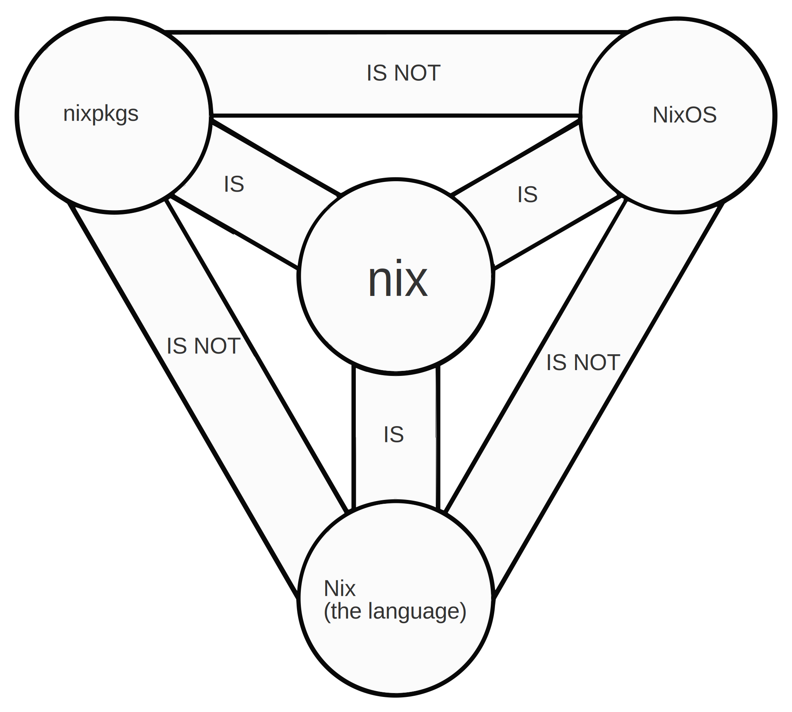

<h1 align="center"> Sanatana Linux</h1>

<div style="display: inline-bock; width: 100%;">


</div>

<br>
<br>
<br> 
<strong><em><big><b>सनातन SANATANA</b></big>: <br></em>
<span style="margin-left: 45px;">Perpetual, constant, eternal, permanent; Firm, fixed, settled;Primeval, ancient.  - <small><a href="https://dsal.uchicago.edu/cgi-bin/app/apte_query.py?qs=Sanatana&matchtype=default">DSAL Online Sanskrit Dictionary</a></small></span>
</strong>
<br>
<br>

<br>
<br>

---

<br>
<br>
<br>

<br>

[](https://builtwithnix.org)

> [!Warning]
>
> While I hope you can gain from my configuration and have attempted, for my own sake at least, to document what is going on in the configuration as thoroughly as possible, this is my configuration that I use personally and as such it is reasonable to assume it is highly unstable, subject to sudden radical changes in form and function coming after long periods of stagnation and is thus a perpetual a work in progress much as its author.

## Hosts

| Host | Machine | Description |
|------|---------|-------------|
| `bagalamukhi` | Lenovo Legion 16IRX9H | Primary workstation (NVIDIA + Intel, AwesomeWM) |
| `matangi` | Lenovo Legion | Secondary system |
| `chhinamasta` | Live USB / ISO | Portable installer and rescue environment |

```bash
# Build and switch
sudo nixos-rebuild switch --flake .#bagalamukhi

# Test without switching
sudo nixos-rebuild test --flake .#bagalamukhi

# Build ISO
nix build .#nixosConfigurations.chhinamasta.config.system.build.isoImage
```

## Module Architecture

The configuration has been refactored from an **activate-by-import** pattern to an **activate-by-enable-option** pattern. Every module now exposes a `config.modules.<category>.<name>.enable` option, making the entire system composable and self-documenting.

```
modules/
  nixos/                        # System-level modules
    ai/                         # AI/ML tooling (CUDA, etc.)
    base/                       # Core system defaults
    desktop/                    # Desktop environments (AwesomeWM, XFCE, Newm)
    environment/                # Environment variables, session
    hardware/                   # NVIDIA, audio (Pipewire), peripherals
    packages/                   # Package collections
    performance/                # ZRAM, systemd-oomd, tuning
    power/                      # Power management
    printer/                    # Printing services
    programs/                   # Thunar, nix-ld, general programs
    security/                   # Security hardening
    services/                   # Networking, systemd units, Android
    shell/                      # Shell configuration
    system/                     # Users, boot, locale
users/ # User account declarations
virtualization/ # Waydroid, containers
home-manager/ # User-level modules (Home Manager)
    desktop/                    # Per-user desktop config
    packages/                   # Per-user package sets
    programs/                   # Firefox, Neovim, etc.
    services/                   # User services
    shell/                      # Zsh, Starship
    theme.nix                   # Theming
    xresources.nix              # X resources
```

Each module follows a consistent structure:

```nix
{ config, lib, ... }:
let
  cfg = config.modules.category.name;
in {
  options.modules.category.name = {
    enable = lib.mkEnableOption "description";
  };
  config = lib.mkIf cfg.enable {
    # ...
  };
}
```

## Documentation


### Quickstart

**[⚡ Installation Quickstart](../.documentation/quickstart.md)** - Single-command installation script + post-install secrets bootstrap

### Installation and Setup

1. [Encrypted Root Setup](../.documentation/encrypted-root.md) - LUKS root partition details.
1. [Live USB / ISO](../.documentation/live-usb.md) - Building and using the Chhinamasta live environment.

### Nix Reference

1. [Useful Nix Commands](../.documentation/nix-commands.md) - Command reference informing the nix wrapper script.
1. [Nix Modules Explained Coherently](../.documentation/Nix_Modules_Explained_Coherently.md) - A walkthrough of how NixOS modules actually work.
1. [Flakes](../.documentation/FLAKES.md) - Flake concepts and usage.
1. [flake.nix Walkthrough](../.documentation/flake.nix.md) - Annotated breakdown of this repository's flake.
1. [Using Repository Templates](../.documentation/using-repository-templates.md) - Dev shell templates and how to use them.
1. [Searching and Installing Packages](../.documentation/searching-and-installing-packages.md) - Package discovery workflows.

### Hardware and Desktop

1. [NVIDIA Settings](../.documentation/nvidia-settings.md) - NVIDIA driver and CUDA configuration notes.
1. [Advanced BIOS for Lenovo Legion](../.documentation/lenovo-advanced-bios.md) - Access the unlocked "Advanced BIOS" firmware settings from the Grub boot menu.

### Secrets

1. [Secrets Research](../.documentation/secrets-research.md) - Evaluating secret management approaches.
1. [Secrets](../.documentation/secrets.md) - Current secrets management strategy.
1. [SOPS](../.documentation/sops.md) - sops-nix integration details.

### Debugging

1. [Debugging Journal](../.documentation/debugging/index.md) - Logs of problems and mitigations; useful for insight into the process of adjusting to NixOS.
1. [NVIDIA Reinstallation](../.documentation/debugging/nvidia-reinstallation-nightmare.md)
1. [CUDA Compatibility](../.documentation/debugging/cuda-compat.md)
1. [Nix Store Issues](../.documentation/debugging/nix-store-issue.md)
1. [CPU/Memory Overload](../.documentation/debugging/cpu-mem-overload-install.md)
1. [Display Manager Troubleshooting](../.documentation/debugging/display-manager.md)
1. [Zsh Slowdown](../.documentation/debugging/zsh-slowdown.md)
1. [Systemd VConsole](../.documentation/debugging/systemd-vconsole-setup-font.md)
1. [GCC Compilation](../.documentation/debugging/gcc-cannot-compile-during-rebuild.md)
1. [Not Enough Memory](../.documentation/debugging/not-enough-memory.md)
1. [Annoying Permissions](../.documentation/debugging/annoying-permissions-errors.md)
1. [Neovim](../.documentation/debugging/nvim.md)

### Credits

1. [Inspiration and Credits](../.documentation/credits.md) - Those who have inadvertently helped along in this process either as inspiration or through careful examination of their implementations.

## Swarm Engineering

The module refactoring -- migrating dozens of NixOS and Home Manager modules from the legacy activate-by-import pattern to the enable-option pattern -- was carried out using **swarm engineering**, an agentic AI workflow where multiple specialized coding agents operate in parallel on isolated worktrees, each tackling a discrete subtask with built-in review gates.

This approach considerably reduced the tedium and error-prone nature of porting a large number of files and configurations from one module paradigm to another. The kind of work involved -- mechanical yet context-sensitive, repetitive yet requiring consistency across many files -- is exactly the sort of refactoring that is hard to test incrementally and easy to get subtly wrong by hand. Swarm orchestration made it tractable: each module conversion was an atomic unit of work, independently verifiable, with an agent-reviewer loop catching regressions before they merged.

It helped that the agents used in this project were defined with Nix-language-specific expertise (see [AGENTS.md](../AGENTS.md)), and that recent Claude and Gemini models appear to have been trained on enough modern Nix code to handle it competently. This is noteworthy because Nix -- especially in the context of system configuration via flakes -- has historically been a pain point for LLMs: a niche use of a niche language with sparse training data and idiosyncratic patterns. The current generation of models has closed that gap enough to be genuinely useful for this kind of structured refactoring work.

<figure>


<figcaption> 
<a href="https://writerit.nl/software/nixos/my-personal-journey-into-nixos/">Image Sourced from the Writer IT Blog</a>
</figcaption>
</figure>
