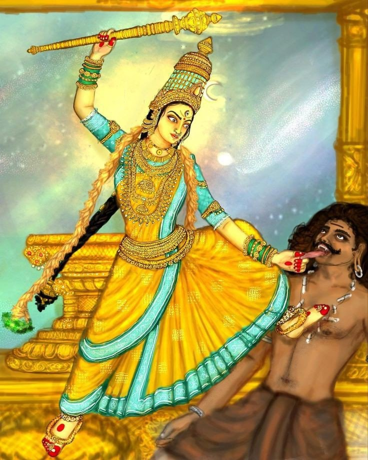
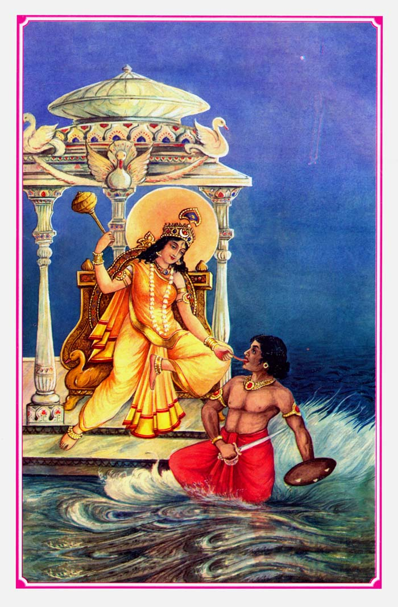

# Host: Bagalamukhi

## Hardware Specs 

<table>
<tr><td>Manufacturer:</td> <td>Lenovo</td> </tr>

<tr><td>Model:</td> <td>Legion Pro 5 16irx9h</td></tr>

<tr><td>CPU:</td> <td>Intel i9 14900Hx</td></tr>

<tr><td>RAM:</td> <td>32GB DDR5 (for now)</td></tr>

<tr><td>GPU:</td> <td>Nvidia 470</td> </tr>
<table>

 
 
 

### Maa Bagalamukhi

Her Legend as told [on Wikipedia](https://en.wikipedia.org/wiki/Bagalamukhi#Legend) will hopefully give the reader some context and inspire them to discover the profound wisdon for themselves in reflecting upon its meaning:

> Another tale records that a demon named Madan acquired Vak-siddhi, by which whatever he said came true. He misused it to trouble humans and murder people. The gods beseeched Bagalamukhi. The goddess grabbed the demon's tongue and immobilized his power. Madan requested the goddess that he be worshipped with her; the goddess granted him this boon, before slaying him.

From the Rudrayamala, a Tantric Scripture, regarding Maa Bagalamukhi:

> By the effect of Your Mantra good conversationalists become speechless; rich become beggars; devastating fire gets cooled. The anger of the angry person is removed; an evil minded person becomes good. The quick moving person becomes crippled. The conceit of the conceited person is reduced. Knowledgeable person nearly becomes a fool. Salutations to the compassionate Bagalamukhi!

