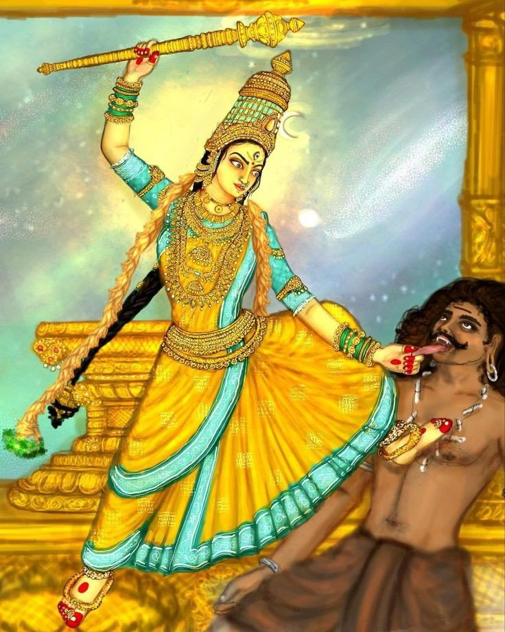

# Host: Bagalamukhi

 

## Hardware Specs

<table>
<tr><td>Manufacturer:</td> <td>Lenovo</td> </tr>

<tr><td>Model:</td> <td>Legion Pro 5 16irx9h</td></tr>

<tr><td>CPU:</td> <td>Intel i9 14900Hx</td></tr>

<tr><td>RAM:</td> <td>32GB DDR5 (for now)</td></tr>

<tr><td>GPU:</td> <td>Nvidia 470</td> </tr>
<table>

 
 
 

### About the Goddess Bagalamukhi

Maa Bagalamukhi, also known as Pitambara Peethambara Peeta or Pitaambara Peeetha, is the eighth Mahavidya, a group of ten wisdom goddesses in Hindu tantric tradition. She is depicted as a beautiful woman, with four arms, holding a club, a bow and arrow, and a rosary, and seated on a lion or a lotus. Her complexion is golden, and she wears yellow clothes, hence her name, which translates to "the one with the yellow dress." Maa Bagalamukhi is associated with the Bijakshara (seed syllable) "Hrim," which is believed to hold immense power and is used in tantric practices.

Maa Bagalamukhi is considered the presiding deity of power, victory, and control. She is believed to bestow victory over enemies, both external and internal, and is often invoked for success in battles, competitions, and arguments. According to Hindu mythology, Maa Bagalamukhi is the consort of Lord Vishnu, and is often depicted as a manifestation of Goddess Durga. She is also associated with the concept of "Bagalamukhi Yoga," a tantric practice that involves the control of the mind and senses to achieve spiritual liberation. Maa Bagalamukhi is believed to have the power to control and bind the mind and speech of her devotees, as well as their enemies, and is often worshipped for her ability to grant success and victory in all endeavors.
