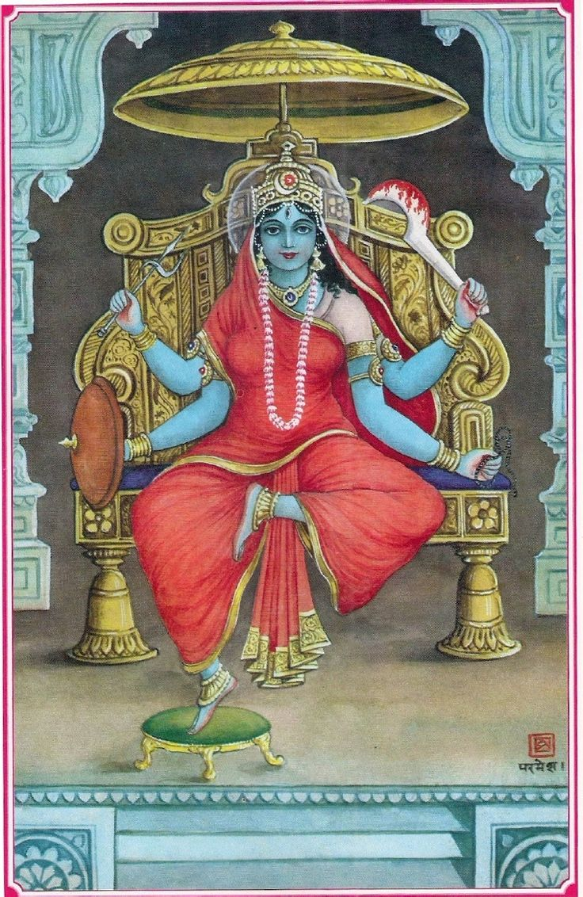

# Host: Matangi

## Hardware Specs

<table>
<tr><td>Manufacturer:</td> <td>Lenovo</td> </tr>

<tr><td>Model:</td> <td>Legion Pro 5 16irx9h</td></tr>

<tr><td>CPU:</td> <td>Intel i9 14900Hx</td></tr>

<tr><td>RAM:</td> <td>32GB DDR5 (for now)</td></tr>

<tr><td>GPU:</td> <td>Nvidia 470</td> </tr>
<table>

 
 
 

### About the Goddess Maa Tangi

Maa Tangi, also known as Matangi, is the seventh Mahavidya, a group of ten wisdom goddesses in Hindu tantric tradition. She is often depicted as a dark-skinned woman, wearing red or green clothes, adorned with ornaments, and seated on a throne or a lotus. She holds a book, a rosary, and a thunderbolt (vajra) in her hands, symbolizing her power over knowledge, speech, and action. Maa Tangi is associated with the Bijakshara (seed syllable) "Klim," which is believed to hold immense power and is used in tantric practices.

Maa Tangi is considered the presiding deity of the subtle element of sound (Shabda Tattva) and is often referred to as the goddess of learning and speech. She is believed to bestow knowledge, wisdom, and eloquence upon her devotees. According to Hindu mythology, Maa Tangi is the daughter of Lord Shiva and Goddess Parvati, and is often depicted as a manifestation of Saraswati, the goddess of knowledge and arts. However, unlike Saraswati who is associated with the creation of the universe, Maa Tangi is more connected with the preservation and destruction of the universe through her control over sound and speech. She is also associated with the concept of "Matangi Yoga," a tantric practice that involves the control of breath and sound to achieve spiritual liberation.
